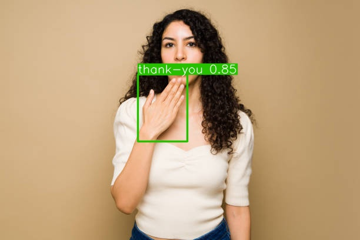
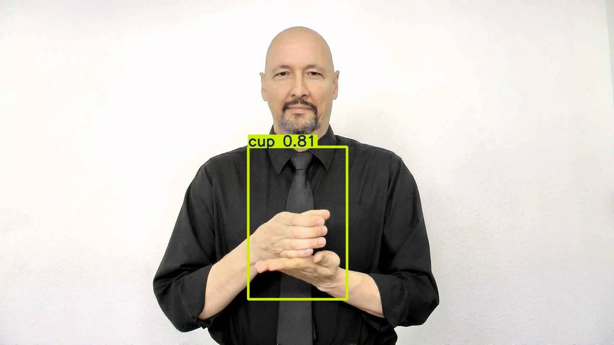

# Project Title: American Sign Language Detection using YOLO11

## Project Overview

This project develops a deep learning model for accurate American Sign Language (ASL) gesture recognition using 23,343 annotated images of 106 gestures from Roboflow. The YOLOv11m model, fine-tuned on the dataset (88% training, 8% validation, 4% testing) with augmentations, balances speed and accuracy through its three-stage architecture (backbone, neck, head). Performance is evaluated using mAP, precision, recall, and F1 score. This work aims to enhance real-time gesture recognition for communication aids, mobile apps, and educational tools.

## Project Goals

1. [**Train and Evaluate the YOLOv11m Model on ASL Dataset**](#goal-1-train-and-evaluate-the-yolov11m-model-on-asl-dataset)

   - Train the YOLOv11m model using the provided ASL dataset.
   - Evaluate its performance using metrics such as mAP, precision, recall, and F1 score.
   - Run inference and make predictions on the test set.

2. [**Develop and Compare a Custom Convolutional Neural Network (CNN)**](#goal-2-develop-and-compare-a-custom-convolutional-neural-network-cnn)

   - Build a tailored CNN for ASL gesture recognition.
   - Compare its performance with the YOLOv11m model on the same dataset to identify strengths and weaknesses.

3. [**Test the YOLOv11m Model on a Different ASL Dataset**](#goal-3-test-the-yolov11m-model-on-a-different-asl-dataset)

   - Evaluate the generalization capabilities of the YOLOv11m model by testing it on an unseen ASL dataset.
   - Analyze its performance and identify areas for improvement.

4. [**Deploy the Best Model for Real-Time ASL Gesture Recognition**](#goal-4-deploy-the-best-model-for-real-time-asl-gesture-recognition)
   - Deploy the best-performing model into a user-friendly application using Flask.

## Goal 1: Train and Evaluate the YOLOv11m Model on ASL Dataset

### Process Overview

The `YOLOv11m` model was trained on the American Sign Language (ASL) dataset for 10 epochs to detect and classify gestures, with the number of epochs determined through a trial-and-error method for optimal performance. After training, the `best.pt` model, representing the optimal weights obtained during the training process, was used for inference. Inference was performed on the test set images to evaluate the models ability to accurately predict the ASL gestures, assessing its performance on unseen data.

### Dataset Details

The dataset was collected from Roboflow to develop an ASL gesture recognition model. We downloaded the dataset through the Roboflow API.

- **Size**: 23,343 images.
- **Annotations**: YOLOv11 format.
- **Classes**: 106 hand gestures.
- **Preprocessing**:
  - Auto-orientation of pixel data with EXIF orientation stripping.
  - Resizing images to 640x640 pixels (stretched format).
- **Augmentation**:
  - Three versions of each source image were created.
  - Random Gaussian blur transformations (0 to 2.5 pixels) applied to bounding boxes.
- **Dataset Split**:
  - 88% training
  - 8% validation
  - 4% testing

### Model Training

This code loads the YOLOv11m model and trains it on the specified ASL dataset using the following parameters:

- **Data**: Path to the dataset configuration file (data.yaml).
- **Image Size**: 640x640 pixels.
- **Epochs**: 10(chosen based on a trial-and-error method for optimal performance)
- **Device**: CUDA-enabled GPU (cuda:0) for faster training.

### Model Evaluation

**Training Results:**

**Training Metrics:**

- Mean Average Precision: 0.98476
- Precision: 0.94401
- Recall: 0.96658
- F1 Score: 0.9551616891117404

**Validation Results:**

 
 

 
 

**Inference on Test set images:**

This code loads the best-trained YOLO model (best.pt) and performs inference on the test set images. The predictions are saved to the results folder.

**Test Metrics:**

- Mean Average Precision: 0.9795211162411303
- Precision: 0.957824208242933
- Recall: 0.957551676142314
- F1 Score: 0.9507314892342847

**Predictions on Test set images:**

 
 

 
 

 
 

## Goal 2: Develop and Compare a Custom Convolutional Neural Network (CNN)

### Process Overview

The YOLOv11-formatted dataset was converted into a format suitable for a custom CNN. The training, validation, and test sets were extracted from their respective directories and prepared for model training. A custom convolutional neural network was implemented using TensorFlow/Keras, with layers optimized for the ASL dataset. The custom CNN was trained on the prepared dataset, utilizing early stopping and learning rate reduction callbacks to optimize performance. The trained model was then evaluated on the test set to assess its accuracy in detecting and classifying ASL gestures.

### Dataset Details

**Classes in dataset:**

**YOLO format to CNN format conversion:**

This code converts YOLO-formatted annotations into a custom CNN-compatible format by extracting bounding box coordinates and cropping the images accordingly. It then resizes the cropped images and saves them into class-specific directories for model training.

`convert_dataset` function is applied to training, validation, and test sets and results are saved into respective class-specific directories for each dataset.

### Data Augmentation and Preprocessing

This code applies data augmentation to the training set using random transformations such as rotation, shift, shear, and zoom to enhance model generalization. The training and validation datasets are then prepared using `ImageDataGenerator` for batch processing, with pixel values rescaled for normalization.

**Compute class weights:**

This code calculates class weights using the training labels to handle class imbalance. The `compute_class_weight` function assigns weights inversely proportional to class frequency, and the resulting class weights are stored in a dictionary.

### Custom CNN model

This code defines a custom CNN model with three convolutional layers, each followed by max pooling and L2 regularization to reduce overfitting. The model is flattened and followed by dense layers with dropout for regularization, culminating in a softmax output layer for multi-class classification of 106 ASL gestures.

**Model Compilation and Callbacks:**

The model is compiled using the Adam optimizer with a learning rate of 1e-4 and sparse categorical cross-entropy loss for multi-class classification. Early stopping and learning rate reduction on plateau callbacks are applied to prevent overfitting and adjust the learning rate if validation loss plateaus.

### Model Training

The model is trained for 30 epochs using the training and validation generators, with class weights to handle class imbalance. Early stopping and learning rate reduction callbacks are applied to optimize training, and performance is evaluated on the validation set.

**Model Summary:**

### Model Evaluation

**Training, validation and testing metrics:**

- Train Loss: 1.4262231588363647
- Train Accuracy: 0.7428082227706909
- Validation Loss: 1.0378884077072144
- Validation Accuracy: 0.85887610912323
- Test Loss: 1.085860013961792
- Test Accuracy: 0.8521634340286255

### Prediction on a sample from test set

### YOLO11 vs Custom CNN

- The YOLOv11 model outperformed the custom CNN with a significantly higher Mean Average Precision (Train: 0.98476, Test: 0.9795) and lower loss (0.3).

- This highlights YOLO's superior accuracy and efficiency, making it the best choice for image detection tasks.

## Goal 3: Test the YOLOv11m Model on a Different ASL Dataset

### Process overview

The trained YOLOv11 model (best.pt) was tested on 10 random images of American Sign Language (ASL) gestures sourced from Google, distinct from the training dataset. Despite being trained on a specific ASL dataset, the model showed high accuracy in recognizing and predicting gestures in these unseen images, with predictions closely matching the correct class labels and bounding box locations.

### Predictions

### YOLO11 vs YOLOv9([existing work](https://arxiv.org/pdf/2407.17950)):

The YOLOv11 model outperformed the existing YOLOv9 models in Mean Average Precision (98% vs 97%) and Recall (96% vs 93%), achieving a superior F1 Score of 95%. While the Precision (94%) is slightly lower than YOLOv9e, the overall performance indicates that the yolo11 model works better.

## Goal 4: Deploy the Best Model for Real-Time ASL Gesture Recognition

Flask was used to create a web application for hosting the ASL detection system, enabling users to upload images and view detection results. YOLOv11 was integrated for inference on both uploaded images and real-time webcam feeds, providing seamless image processing and detection outputs.

**website link** --> https://www.google.com/

## Conclusion

In this project, the YOLOv11 model was successfully implemented to detect and interpret American Sign Language (ASL) gestures in real-time. By utilizing an extensive dataset with over 100 ASL gestures and leveraging state-of-the-art architecture, high performance was achieved across key evaluation metrics, including mAP, precision, recall, and F1 score. The results demonstrate the potential of the model to provide an efficient and accurate solution for ASL gesture detection. This project can be further expanded by integrating the model into real-world applications, such as mobile apps or wearable devices, to enable seamless ASL-to-text or ASL-to-speech translation.

## Future Scope

Future work can include enhancing the model's robustness by training it on larger and more diverse datasets, incorporating dynamic gesture recognition for continuous sign language, and supporting multilingual sign languages.

### Code links:

- [yolo11](https://colab.research.google.com/drive/10YPC3s6DPoI4gCjYLiUvh7l-Cw-6Il9B?usp=sharing)
- [Custom CNN](https://colab.research.google.com/drive/1RNbxVb-MPPP0jVYXIxpZHkH_U_TsVshW?usp=sharing)
- [yolo11 on newdataset](https://colab.research.google.com/drive/1NxUZn0juWkZjj0qQJrb5gdjr8jm5njC5?usp=sharing)

### References:

- [Sign lang detection using yolov5](https://www.youtube.com/playlist?list=PLkz_y24mlSJYWpwFbU8fyaBSwihoVHiJz)
- [Sign lang detection using yolo11](https://youtu.be/4AWa59f8kVA?si=h4n9otwCCeawybIv)
- [Ultralytics yolo11](https://docs.ultralytics.com/models/yolo11/#supported-tasks-and-modes)
